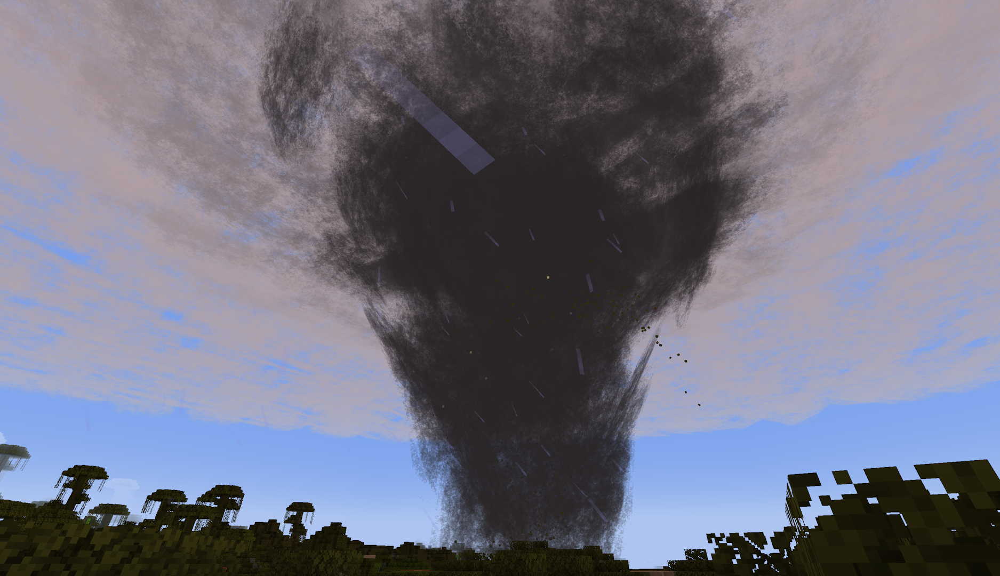

# PMW Rendering Additions

Some additional settings for ProtoManly's Weather Mod focusing on rendering, including a new particle-based renderer. Built to make the original mod more accessable to those with lower-end hardware, mainly for server use.

## Config Options

`render_mode`: The renderer used for volumetrics-based weather effects

- `SHADER` - The default renderer used in the original mod
- `CLASSIC`- A particle-based renderer meant for lower-end devices; heavily inspired by Corosauce's [Weather2](https://github.com/Corosauce/weather2/)
- `DISABLE` - Disables all cloud effects

`enable_mist`: Toggles mist particles used in heavy rain/wind.

`enable_splash`: Toggles splash particles from rain on the ground

`enhanced_fog`: Toggles more intense fog/darkness effects for precipitation, meant to be used with the CLASSIC renderer to make up for a lack of a shader

`update_every_ticks`: Update rate for cloud/storm particle refresh with the CLASSIC renderer

`particle_crossover`: Ticks for particle fading during refresh with the CLASSIC renderer; should only need to be changed if using a resource pack that modifies the cloud texture

`bleed_fix_mode`: Experimental bleeding fixes with the original/SHADER renderer

- `FULL`: Fixes bleeding with a significant performance hit
- `LIGHT`: Fixes bleeding for entities, block entities, and particles (bleeding remains for blocks)
- `DISABLE`: No changes to SHADER rendering behavior